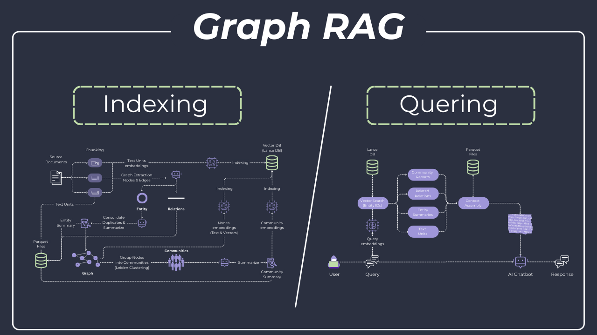

# 🏛️ Mythology GraphRAG - Knowledge Graph-Powered Greek Mythology Assistant

A complete **GraphRAG** (Graph Retrieval-Augmented Generation) application that demonstrates how to build knowledge graphs from text documents and use them to answer questions about Greek mythology. This project showcases modern AI capabilities using Microsoft's GraphRAG library with local LLMs via Ollama.



## 🎯 What This Project Demonstrates

This repository serves as a comprehensive tutorial project for YouTube viewers learning about **GraphRAG** implementation - a more advanced approach than traditional RAG that creates knowledge graphs from documents.

It is featured in a YouTube tutorial covering GraphRAG development:

🔗 [YouTube Tutorial](https://www.youtube.com/watch?v=0kVT1B1yrMc)

[](https://youtu.be/0kVT1B1yrMc)

## 🚀 Key Features

- 📚 **Knowledge Graph Construction**: Automatically extracts entities and relationships from text documents
- 🕸️ **Interactive Graph Visualization**: Explore the knowledge graph with React Flow-based UI
- 🤖 **AI-Powered Q&A**: Ask natural language questions and get context-aware answers using graph retrieval
- 🔒 **100% Local Inference**: Run everything locally with Ollama - no API keys required for basic usage
- ☁️ **Optional Cloud Support**: Optionally use Google Gemini API for faster processing

## 🛠 Technology Stack

### Backend (Python)

- **FastAPI**: High-performance API framework with automatic OpenAPI documentation
- **SQLAlchemy**: SQL toolkit for metadata storage
- **Microsoft GraphRAG**: Graph-based RAG framework for knowledge extraction and querying
- **PostgreSQL**: Relational database for conversation history
- **Ollama**: Local LLM serving (supports Gemma, Llama, Mistral, etc.)

### Frontend (TypeScript/React)

- **React 19**: Modern React with latest features
- **Vite**: Lightning-fast build tool
- **TailwindCSS**: Utility-first CSS framework
- **SWR**: Data fetching with caching and revalidation
- **React Flow**: Interactive graph visualization library

### Infrastructure

- **Docker Compose**: Multi-container orchestration
- **uv**: Fast Python package management

## 🏃‍♂️ Quick Start

### Prerequisites

- **Docker & Docker Compose** (required)
- **8GB+ RAM** (for running local LLMs)
- **10GB+ disk space** (for models and data)
- **NVIDIA GPU** (optional, for faster inference)
- **Git** (for cloning the repository)

### 1. Clone and Setup

```bash
# Clone the repository
git clone https://github.com/dev-it-with-me/MythologyGraphRag.git
cd MythologyGraphRag

# Copy environment template
cp .env.example .env
```

### 2. Configure Environment Variables

Edit `.env` with your preferred settings:

```env
# PostgreSQL Configuration
APP_PG_USER=mythuser
APP_PG_PASSWORD=your_secure_password
APP_PG_DATABASE=mythology_db
APP_PG_PORT=5432

# Model Provider: "ollama" (local) or "gemini" (Google API)
APP_MODEL_PROVIDER=ollama

# Ollama Models
APP_OLLAMA_BASE_URL=http://host.docker.internal:11434
APP_OLLAMA_LLM_MODEL=qwen2.5:3b
APP_OLLAMA_EMBED_MODEL=nomic-embed-text

# Optional: Google Gemini API (faster, requires API key)
# APP_MODEL_PROVIDER=gemini
# APP_GEMINI_API_KEY=your-api-key-here
```

### 3. Create Required Directories

```bash
# Create the ragtest directory (required for Docker build)
mkdir -p backend/ragtest
```

> **Note:** This directory is gitignored but required by Docker. If you later build a knowledge graph locally, you can easily switch to Docker and carry over your data.

### 4. Start All Services

```bash
# Start all services (this will build frontend and download models automatically)
docker compose up -d

# Monitor the logs to see when everything is ready
docker compose logs -f
```

> **Note:** First startup takes 5-10 minutes as it builds the frontend and downloads the LLM models.

### 5. Initialize the Application

```bash
# Initialize database tables
docker compose exec backend uv run scripts/init_db.py

# Set up GraphRAG workspace
docker compose exec backend uv run scripts/init_graphrag.py
```

### 6. Access the Application

- **Application**: [http://localhost:8000](http://localhost:8000)
- **API Documentation**: [http://localhost:8000/docs](http://localhost:8000/docs)
- **API Redoc**: [http://localhost:8000/redoc](http://localhost:8000/redoc)
- **Health Check**: [http://localhost:8000/health](http://localhost:8000/health)

> **Note:** The frontend is built and served as static files by the backend. Everything runs on port 8000.

## 📖 Usage Examples

### Upload a Document

```bash
# Upload the sample Greek mythology document
curl -X POST "http://localhost:8000/api/index/upload" \
  -H "Content-Type: multipart/form-data" \
  -F "file=@{your_test_file_path}"
```

Or use the Swagger UI at http://localhost:8000/docs

### Ask Questions

Try asking these questions in the chat interface:

- "Who is Zeus and what are his powers?"
- "What is the relationship between Zeus and Hera?"
- "Tell me about the Twelve Olympians"
- "Who are the children of Kronos?"
- "What happened during the Titanomachy?"

### Data Flow

1. **Document Upload**: Text documents are uploaded via API
2. **Graph Extraction**: GraphRAG extracts entities (gods, places, events) and relationships
3. **Graph Storage**: Knowledge graph is stored in LanceDB with vector embeddings
4. **Query Processing**: User questions trigger graph traversal and context retrieval
5. **Response Generation**: Retrieved context is sent to LLM for answer generation
6. **History Tracking**: All conversations are persisted in PostgreSQL

## 🛠️ Development Setup

### Local Development (without Docker)

If you prefer to run services locally:

1. **Install Python dependencies:**

```bash
# Install uv package manager
curl -LsSf https://astral.sh/uv/install.sh | sh

# Install dependencies
cd backend
uv sync
```

2. **Start PostgreSQL:**

```bash
docker run -d \
  --name postgres \
  -p 5432:5432 \
  -e POSTGRES_USER=mythuser \
  -e POSTGRES_PASSWORD=mythpass123 \
  -e POSTGRES_DB=mythology_db \
  postgres:17-alpine
```

3. **Start Ollama:**

```bash
# Install Ollama (see https://ollama.ai)
ollama serve

# Pull required models
ollama pull qwen2.5:3b
ollama pull nomic-embed-text
```

4. **Configure environment:**

```bash
cd backend
cp .env.example .env.local
# Edit .env.local with your local settings
```

5. **Start the backend:**

```bash
cd backend
uv run uvicorn app.main:app --reload --host 0.0.0.0 --port 8000
```

6. **Start the frontend:**

```bash
cd frontend
npm install
npm run dev
```

> **Note:** In local development, frontend runs on port 3000 with Vite's dev server proxying API requests to the backend on port 8000.

### 🐳 Docker Deployment Details

The Docker setup uses a multi-stage build that:

1. **Builds the frontend** using Node.js 22
2. **Installs Python dependencies** using uv
3. **Creates the runtime image** with both backend and pre-built frontend static files

### Architecture

```
┌─────────────────────────────────────────────────────┐
│                   Docker Compose                     │
├─────────────────────────────────────────────────────┤
│  ┌─────────────┐  ┌─────────────┐  ┌─────────────┐  │
│  │  PostgreSQL │  │   Ollama    │  │   Backend   │  │
│  │   :5432     │  │   :11434    │  │   :8000     │  │
│  │             │  │             │  │             │  │
│  │  Database   │  │  LLM/Embed  │  │ FastAPI +   │  │
│  │  Storage    │  │   Models    │  │ Static UI   │  │
│  └─────────────┘  └─────────────┘  └─────────────┘  │
└─────────────────────────────────────────────────────┘
```

### Rebuilding After Changes

```bash
# Rebuild backend (includes frontend build)
docker compose up -d --build backend

# Rebuild everything
docker compose up -d --build

# View logs
docker compose logs -f backend
```

### Production Considerations

For production deployments:

- Set `APP_DEBUG=false` in your `.env` file
- Use strong passwords for `APP_PG_PASSWORD`
- Consider using a reverse proxy (nginx/traefik) for SSL termination
- Mount persistent volumes for data durability

## 📊 Project Structure

```
MythologyGraphRAG/
├── .env.example              # Environment variables template
├── .gitignore                # Git ignore rules
├── docker-compose.yml        # Docker services orchestration
├── README.md                 # Project documentation
│
├── backend/
│   ├── .env.example          # Backend environment template (local dev)
│   ├── .dockerignore         # Docker build ignore rules
│   ├── .python-version       # Python version specification (3.12)
│   ├── Dockerfile            # Multi-stage Docker build
│   ├── pyproject.toml        # Python dependencies (uv)
│   ├── uv.lock               # Locked dependencies
│   │
│   ├── app/
│   │   ├── __init__.py
│   │   ├── main.py           # FastAPI application entry point
│   │   ├── config.py         # Pydantic settings configuration
│   │   ├── database.py       # SQLAlchemy async database setup
│   │   ├── api/              # API route handlers
│   │   │   ├── chat.py       # Chat & conversation endpoints
│   │   │   ├── graph.py      # Graph visualization endpoints
│   │   │   └── index.py      # Document upload & indexing
│   │   ├── schemas/          # Pydantic request/response models
│   │   │   ├── chat.py
│   │   │   ├── graph.py
│   │   │   └── index.py
│   │   └── services/         # Business logic layer
│   │       ├── chat.py       # Conversation & query processing
│   │       └── graphrag.py   # GraphRAG indexing & search
│   │
│   ├── scripts/
│   │   ├── init_db.py        # Database tables initialization
│   │   └── init_graphrag.py  # GraphRAG workspace setup
│   │
│   ├── ragtest/              # GraphRAG workspace (gitignored content)
│   │   ├── settings.yaml     # GraphRAG configuration
│   │   ├── input/            # Source documents for indexing
│   │   ├── output/           # Generated parquet files & LanceDB
│   │   └── cache/            # LLM response cache
│   │
│   └── logs/                 # Application logs (gitignored)
│
├── frontend/
│   ├── index.html            # HTML entry point
│   ├── package.json          # NPM dependencies
│   ├── vite.config.ts        # Vite build configuration
│   ├── tailwind.config.js    # TailwindCSS configuration
│   ├── tsconfig.json         # TypeScript configuration
│   │
│   └── src/
│       ├── main.tsx          # React entry point
│       ├── App.tsx           # Root component
│       ├── app/              # Application shell & routing
│       │   ├── index.tsx
│       │   └── router.tsx
│       ├── pages/            # Page-level components
│       │   └── chat/         # Main chat page
│       ├── widgets/          # Complex composite components
│       │   ├── chat-interface/
│       │   ├── graph-visualization/
│       │   └── node-details/
│       ├── features/         # Feature-specific logic
│       │   ├── send-message/
│       │   └── upload-document/
│       ├── entities/         # Domain models & API
│       │   ├── conversation/
│       │   ├── graph-node/
│       │   └── message/
│       └── shared/           # Shared utilities & UI components
│           ├── api/          # Axios client & endpoints
│           ├── config/       # Constants & configuration
│           ├── lib/          # Utility functions
│           └── ui/           # Reusable UI components
│
└── docs/                     # Documentation assets
    └── graphrag-preview.png  # Screenshot for README
```

## 🔧 Configuration

### Model Providers

This project supports two model providers:

| Provider   | Pros                                    | Cons                                 |
| ---------- | --------------------------------------- | ------------------------------------ |
| **Ollama** | 100% local, no API costs, data privacy  | Slower, requires more RAM            |
| **Gemini** | Fast, high quality, free tier available | Requires API key, data sent to cloud |

### Environment Variables

| Variable                 | Description                           | Default               |
| ------------------------ | ------------------------------------- | --------------------- |
| `APP_MODEL_PROVIDER`     | Model provider (`ollama` or `gemini`) | `ollama`              |
| `APP_OLLAMA_LLM_MODEL`   | Ollama chat model                     | `qwen2.5:3b`          |
| `APP_OLLAMA_EMBED_MODEL` | Ollama embedding model                | `nomic-embed-text`    |
| `APP_GEMINI_API_KEY`     | Google Gemini API key                 | -                     |
| `APP_PG_USER`            | PostgreSQL username                   | `mythuser`            |
| `APP_PG_PASSWORD`        | PostgreSQL password                   | `mythpass123`         |
| `APP_PG_DATABASE`        | PostgreSQL database name              | `mythology_db`        |
| `APP_OLLAMA_BASE_URL`    | Ollama server URL                     | `http://host.docker.internal:11434` |
| `APP_GEMINI_LLM_MODEL`   | Gemini LLM model name                 | -                     |
| `APP_GEMINI_EMBED_MODEL` | Gemini embedding model name           | -                     |
| `APP_PG_PORT`            | PostgreSQL port                       | `5432`                |
| `APP_DEBUG`              | Enable debug mode                     | `true`                |


## 🐛 Troubleshooting

### Ollama Models Not Loading

```bash
# Check if models are downloaded in native Ollama
ollama list

# Manually pull models if needed
ollama pull qwen2.5:3b
ollama pull nomic-embed-text
```

### Database Connection Issues

```bash
# Restart PostgreSQL
docker compose restart postgres

# Check logs
docker compose logs postgres
```

### GraphRAG Indexing Fails

```bash
# Check backend logs
docker compose logs backend

# Verify Ollama is accessible from the backend container
docker compose exec backend python -c "import httpx; print(httpx.get('http://host.docker.internal:11434/api/tags').json())"
```

## 🔄 Stopping and Cleanup

```bash
# Stop all services
docker compose down

# Stop and remove volumes (WARNING: deletes all data)
docker compose down -v
```

## 📺 YouTube Tutorial Series

This project is featured in a YouTube tutorial covering GraphRAG development:

🔗 [YouTube Tutorial](https://www.youtube.com/watch?v=0kVT1B1yrMc)

[](https://youtu.be/0kVT1B1yrMc)

🔔 Subscribe to [@DevItWithMe](https://www.youtube.com/@DevItWithMe) for more!

## 🤝 Support & Contribution

🙏 If you find this project helpful, consider [Buying Me a Coffee](https://buymeacoffee.com/dev.it)

⭐ Star this repository if it helps you learn GraphRAG development!

🐛 Found a bug? [Open an issue](https://github.com/dev-it-with-me/MythologyGraphRAG/issues)

💬 Have questions? [Start a discussion](https://github.com/dev-it-with-me/MythologyGraphRAG/discussions)

## 📖 Learn More

- [Microsoft GraphRAG](https://github.com/microsoft/graphrag)
- [FastAPI Documentation](https://fastapi.tiangolo.com/)
- [Ollama Documentation](https://ollama.ai/)
- [React Flow](https://reactflow.dev/)
